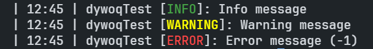

# Example

```cs
using DywoqConsoleSystem;

public class Program
{
  static void Main(string[] args)
  {
    ConsoleInstance console = new();
    console.Properties.IsWithStyle = true;
    console.Properties.IsWithPrefix = true;
    console.Properties.IsWithTimeStamp = true;

    console.Properties.Prefix = "dywoqTest";

    console.Info("Info message");
    console.Warning("Warning message");
    console.Error(new() { Code = -1, Message = "Error message" });
  }
}
```

Output:

